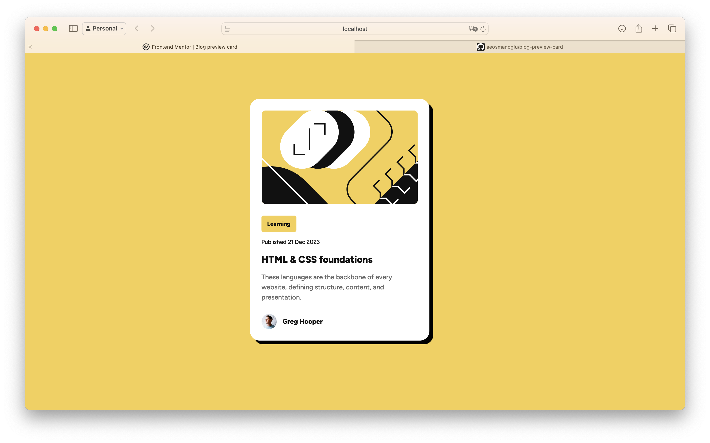

# Frontend Mentor - Blog preview card solution

This is a solution to
the [Blog preview card challenge on Frontend Mentor](https://www.frontendmentor.io/challenges/blog-preview-card-ckPaj01IcS).
Frontend Mentor challenges help you improve your coding skills by building realistic projects.

## Table of contents

- [Overview](#overview)
    - [The challenge](#the-challenge)
    - [Screenshot](#screenshot)
    - [Links](#links)
- [My process](#my-process)
    - [Built with](#built-with)
    - [What I learned](#what-i-learned)
    - [Continued development](#continued-development)
    - [Useful resources](#useful-resources)
- [Author](#author)
- [Acknowledgments](#acknowledgments)

## Overview

### The challenge

Users should be able to:

- See hover and focus states for all interactive elements on the page

### Screenshot



### Links

- Solution URL: [Solution](https://github.com/aeosmanoglu/blog-preview-card)
- Live Site URL: [Live Site](https://aeosmanoglu.github.io/blog-preview-card/)

## My process

### Built with

- Semantic HTML5 markup
- Tailwind CSS
- Flexbox
- Mobile-first workflow

### What I learned

In this project, I strengthened my understanding of Tailwind CSS and how to utilize utility-first CSS frameworks for
rapid prototyping and responsive design. Here are some key pieces of code I’m proud of:

```html
<h1 class="font-extrabold text-xl/[30px] hover:text-yellow-500 hover:cursor-pointer">
    HTML & CSS foundations
</h1>
```

```js
/** @type {import('tailwindcss').Config} */
module.exports = {
    content: ['./index.html'],
    theme: {
        extend: {
            colors: {
                'yellow-500': '#F4D04E',
                'gray-500': '#6B6B6B',
                'gray-950': '#111',
            },
            fontFamily: {
                'figtree': ['Figtree', 'sans-serif'],
            },
            boxShadow: {
                'card': '8px 8px 0 0 rgba(0, 0, 0, 1)',
            },
        },
    },
    plugins: [],
}
```

### Continued development

I plan to continue improving my understanding of responsive design and exploring advanced Tailwind CSS features. Future
projects will also focus on optimizing CSS for performance.

### Useful resources

- [Tailwind CSS Documentation](https://tailwindcss.com/docs) - The official documentation is well-structured and
  immensely helpful in understanding how to implement utility-first design.
- [Frontend Mentor Community](https://www.frontendmentor.io) - A great place to share and receive feedback.

## Author

- Website - [Abuzer Emre Osmanoğlu](https://abuzeremre.com)
- Frontend Mentor - [@aeosmanoglu](https://www.frontendmentor.io/profile/aeosmanoglu)
- Twitter - [@abuzeremreo](https://twitter.com/abuzeremreo)

## Acknowledgments

Big thanks to the Frontend Mentor community for their valuable feedback and inspiration.
